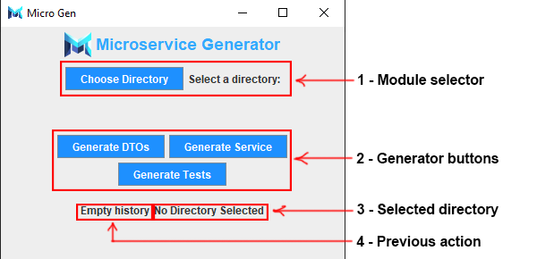

# Microservice Generator (Microsgen)
> The application for generating microservices in SpringBoot
- You can create your own Springboot service with **CRUD operations and full coverage tests** in seconds using only model classes and this application
- On average you would **save 2-6 hours of your time on the service template creation** and would maximaze the focus on the actual logic of your application
- Integrated to work with JPA relations and MongoDB documents
- Best Practices & Design Patterns included
## How to install?
- **Pull with HTTPS -** `git pull https://github.com/skijl/Microservice-Generator.git`
- **Pull with SSH -** `git pull git@github.com:skijl/Microservice-Generator.git`
- **Download ZIP -** `Blue button Code -> Download ZIP`
## How to use?

1. **Module selector** (Select the module directory of your Springboot project)
    - /module directory can contain any number of classes of any names, but they must be the actual entities of JPA or documents of Mongo. 
    - The script supports only one database type per service.
    - The module directory must have the following structure: 
```
module-directory/
│
├─ src/
│  ├─ main/
│  │  ├─ java/
│  │  │  ├─ com/
│  │  │  │  ├─ example/
│  │  │  │  │  ├── module/
│  │  │  │  │  │   └── Entity.java      # Entity class (can have any name)
│  │  │  │  │  ├── Application.java     # Main application class (can have any name)
```
2. **Generator buttons**
    - **Generate DTOs**
        - The first button you would press after the module directory is fully prepared.
        - Generates the /dto directory with /response & /request classes
        - After this script you would have to look at the generated DTO classes and adjust them if you have your specific requirements
    - **Generate Service** (The main script that generates all the service)
        - /mapper - Map between Resquest DTO -> Model & Model -> ResponseDto
        - /repository - JPA/Mongo repository layer for the application
        - /exception - Custom exceptions with Controller Advice for the proper exception handling
        - /service - Service interfaces
        - /service/impl - Service Implementation classes with CRUD operations: create/getById/getAll/update/deleteById
        - /controller - Rest Controller with all the endpoints to interract with service layer. Swagger annotations for all the methods
    - **Generate Tests**
        - Generate tests that cover all the code generated by script
        - It includes all the tests for service and controller layer
3. **Selected directory**
    - Shows the selected directory module
4. **Previous action**
    - Shows the last action
    - Mainly used to see the last executed script and the success of it

`If you have any bug/problem/requirement - please send be descriptive email with screenshots - makhrevychmaxim@gmail.com`