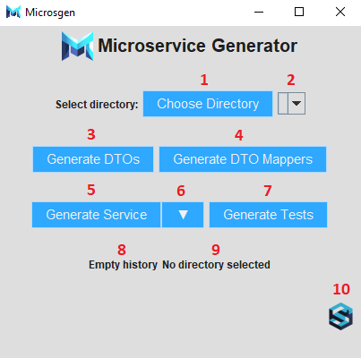
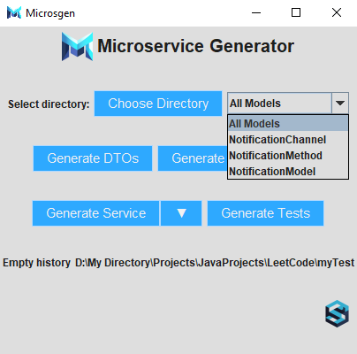
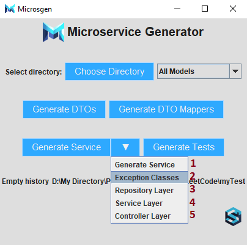
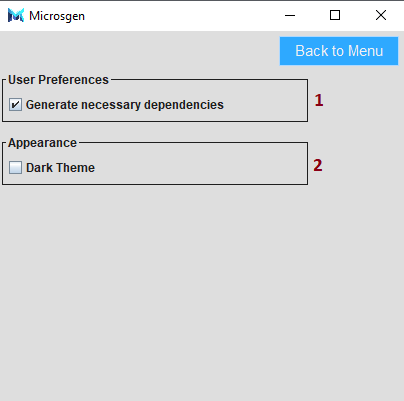

# Microservice Generator (Microsgen)
> The application for generating microservices in SpringBoot
- You can create your own Springboot service with **CRUD operations and full coverage tests** in seconds using only model classes and this application
- On average you would **save 2-6 hours of your time on the service template creation** and would maximaze the focus on the actual logic of your application
- Integrated to work with JPA relations and MongoDB documents
- Best Practices & Design Patterns included
- Application is written in JavaSwing that allows to it to be lightweight and crossplatform. To generate code application runs bash scripts that allows working faster with files.
## How to install?
1) **Initialize git in your directory -** `git init`
2) **Clone with SSH -** `git clone git@github.com:skijl/Microservice_Generator.git`
- OR
1) **Download ZIP -** `Blue button Code -> Download ZIP`
## How to run?
> To run the .jar you must have JDK instlled on your computer. Run the application by going to the terminal and typing `java -jar MicrosGen.jar` after what you will see the main window:

 
1. **Module/Directory selector** (Select the module directory of your Springboot project)
    - Directory must contain Spring Boot project that contains /model directory that can contain any number of classes of any names, but they must be the actual entities of JPA or documents of Mongo:
    ```
    module-directory/
    │
    ├─ src/
    │  ├─ main/
    │  │  ├─ java/
    │  │  │  ├─ com/
    │  │  │  │  ├─ example/
    │  │  │  │  │  ├── model/
    │  │  │  │  │  │   ├── Entity1.java      # Entity classes (can have any name)
    │  │  │  │  │  │   └── Entity2.java
    │  │  │  │  │  ├── Application.java     # Main application class (can have any name)
    ```
    - The script supports only one database type per service.
    - The module directory must have the following structure: 
2. **Model selector** 
    - Accesable only when directory with Spring Boot project is selected and contains models/entities
    - `All Models` - You can generate code for all the models
    - Othervise you can generate code for only exact model
3. **Generate DTOs** (Generate button for DTOs)
    - The first button you would press after the module directory is fully prepared.
    - Generates the /dto directory with /response & /request classes
    - After this script you would have to look at the generated DTO classes and adjust them if you have your specific requirements
4. **Generate DTO Mappers** (Generate button fro DTO Mappers)
    - After you adjusted your DTOs you press this button to create mapper class/classes for your DTOs
    - Creates directory /dto/mapper with classes for mapping between **Resquest DTO -> Model* & **Model -> ResponseDto*
5. **Generate Service**
    - **1** - Generate the whole service
    - **2** - /exception - Custom exceptions with Controller Advice for the proper exception handling
    - **3** - /repository - JPA/Mongo repository layer for the application
    - **4** - /service - Service Implementation classes with CRUD operations: create/getById/getAll/update/deleteById
    - **5** - /controller - Rest Controller with all the endpoints to interract with service layer. Swagger annotations for all the methods
    - 
6. **Select Action**
    - If you want to generate specific layer fo your application, you can use panel to select exact action
7. **Generate Tests** (Generate Tests button)
    - Generate tests that cover all the code generated by script
    - It includes all the tests for service and controller layer
8. **Previous action**
    - Shows the last action
    - Mainly used to see the last executed script and the success of it
9. **Selected directory**
    - Shows the selected directory module
10. **Settings**
    - **1** - You can select if you want to generate dependencies used by scxrip automatically
    - **2** - You can choose if you want to use dark theme
    - 
## Dependencies generated in pom.xml
- Validation dependency:
```
<dependency>
    <groupId>org.springframework.boot</groupId>
    <artifactId>spring-boot-starter-validation</artifactId>
</dependency>
```
- Starter web dependency:
```
<dependency>
    <groupId>org.springframework.boot</groupId>
    <artifactId>spring-boot-starter-web</artifactId>
</dependency>
```
- Open API dependency:
```
<dependency>
    <groupId>org.springdoc</groupId>
    <artifactId>springdoc-openapi-starter-webmvc-ui</artifactId>
    <version>2.5.0</version> <!--any version-->
</dependency>
```
- Lombok dependency:
```
<dependency>
    <groupId>org.projectlombok</groupId>
    <artifactId>lombok</artifactId>
    <optional>true</optional>
</dependency>
```

`If you have any bug/problem/requirement - please send be descriptive email with screenshots - makhrevychmaxim@gmail.com`